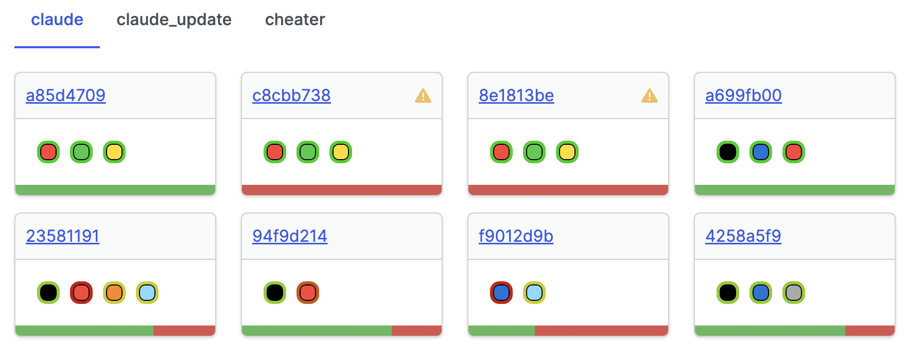
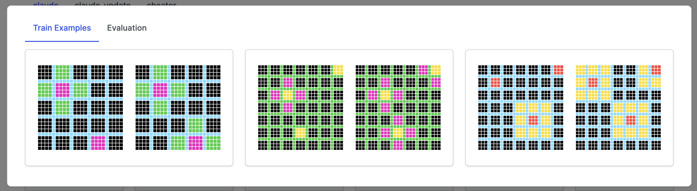
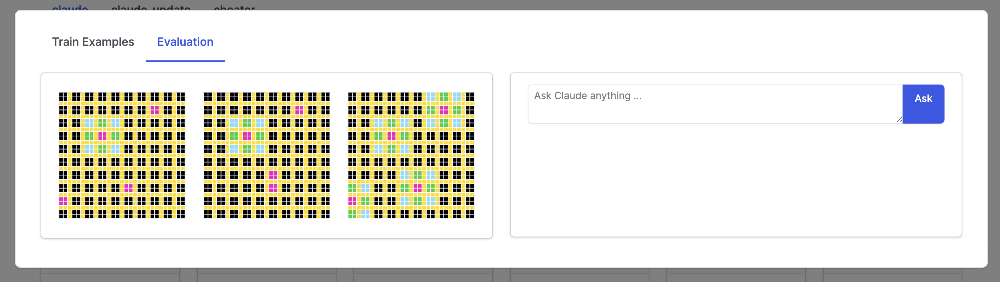

# ARC-Evals

This repository is a lightweight tool for experimenting and evaluating approaches to [https://github.com/fchollet/ARC](The Abstraction and Reasoning Corpus) (ARC).

ARC is evaluated such that perfect performance is required (if you get one cell wrong, you get the question wrong). Because of this, designing tools for quickly iterating on approaches as well as metrics, evaluations, and visualizations are crucial to success in this problem space.

# Instructions

## Installing the project

1. `>>> git clone [this repo]`
2. Install [https://python-poetry.org/](poetry)
3. Create a virtualenv with python >= 3.11
4. `>>> poetry install`

## Launching the UI

`>>> python /path/to/arc_evals/app/app.py`

This will open a page that looks like this:



Each tab corresponds to a different model. The "Cheater" model is a testing model that is allowed to look at the correct answer, so if this doesn't show 100% performance, there is a bug. The "Claude" models are results from using Claude Opus to try and make predictions.

Each card contains a visual representation of the evaluation metrics. The bottom shows the overall percentage accuracy. The circles show performance by color in each grid (a green ring around a black circle means the model performed well on black cells). And a warning symbol in the header means there was an error in model execution or evaluation (often a shape mismatch in the case of Claude).

If you click on the link of a card, it will open something that lets you explore the training examples.



And if you click on the "Evaluation" tab, it will show you, in order, the test input, the predicted output, and the correct output. Additionally there is a chat interface with Claude Opus that has all of the grids in context such that you can ask questions about them.



## Creating Evaluations for an Agent

If you would like to create your own Agent, you can review the `Agent` implementation in `arc_evals/agents/base.py`. Effectively, you only need to implement a `call` function that assumes it gets the loaded `json` corresponding to a single task.

```python
from arc_evals.agents.base import Agent, run_agent
from arc_evals.utils.paths import OUTPUT, TRAINING

class MyAgent(Agent):
  ...

  def call(self, data: dict[str, list[dict[str, list[list[int]]]]]) -> list[list[int]]]:
    """
    implement your custom function here. Recall that the key structure of `data` is:
      data['train']: all training examples
      data['test']: all evaluation examples
      data[key][i]['input'], data[key][i]['output']: an input, output pair for the task
    """
    ...

if __name__ == "__main__":
  agent = MyAgent()
  # NOTE: eventually will integrate this with defaults such that you can just execute agent.run()
  agent.run(agent, "my_agent", OUTPUT, TRAINING)
```

# TODO

1. Create an `LLMAgent` base class as a generalization of `ClaudeAgent`
2. Clean up initial page of the UI. It's a bit too much at the moment
3. Make it easy to compare model predictions across agents, within context for claude chat
4. Create a `TrainAgent` base class that has necessary infrastructure for training ML models
5. Fix bug where if an Agent execution fails, the color-based metrics get marked as passing in the UI
